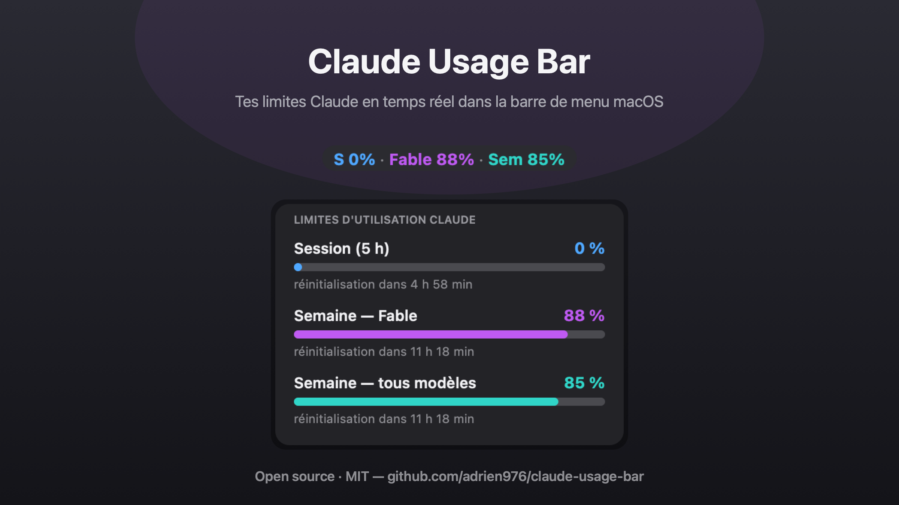

# Claude Usage Bar

**FR** — Affiche ta consommation Claude (session 5 h, limites hebdomadaires, par modèle) en direct dans la barre de menu macOS.
**EN** — Live Claude usage limits (5-hour session, weekly, per-model) in your macOS menu bar.



<p align="center">
  <a href="https://buymeacoffee.com/adrien976"></a>
</p>

## ✨ Fonctionnalités / Features

- **Barre de menu** : `S 5% · Fable 86% · Sem 84%` — une couleur par limite, sur pastille anthracite. Passe au rouge au-delà de 90 %.
- **Menu déroulant** : panneau sombre avec barres de progression et temps de réinitialisation, fidèle au panneau d'utilisation de Claude.
- **Jamais déconnecté** : le plugin possède son propre jeton OAuth (trousseau macOS) et le renouvelle automatiquement en arrière-plan. Pas besoin de Claude Code, pas de jeton à recréer.
- **Hors-ligne** : en cas de coupure réseau, affiche les dernières données en cache (marqueur ⌛).
- Mise à jour toutes les 2 minutes. Aucune dépendance : Python et AppKit fournis par macOS, affichage via [SwiftBar](https://github.com/swiftbar/SwiftBar).

## 🚀 Installation

```bash
git clone https://github.com/adrien976/claude-usage-bar.git
cd claude-usage-bar
./install.sh
```

L'installeur : installe SwiftBar (via Homebrew) si besoin, pose le plugin, puis ouvre une page d'autorisation Claude dans ton navigateur — clique sur **Autoriser**, colle le code affiché dans le Terminal, c'est terminé.

*Prérequis : macOS, [Homebrew](https://brew.sh), un abonnement Claude (Pro / Max).*

## 🔧 Comment ça marche / How it works

Le plugin s'authentifie auprès d'Anthropic par le même flux OAuth (PKCE) que Claude Code, avec la portée minimale `user:profile`, et interroge l'endpoint d'utilisation (`/api/oauth/usage`) qui alimente le panneau « Limites d'utilisation » de l'app Claude. Le jeton est stocké dans le trousseau macOS (`ClaudeUsageBar-credentials`) et renouvelé automatiquement avant expiration. L'affichage (titre et panneau) est dessiné en PNG retina par un petit script JXA/AppKit, ce qui permet un rendu multi-couleurs impossible avec du texte SwiftBar seul.

## ⚠️ Avertissement / Disclaimer

Projet non affilié à Anthropic. Il s'appuie sur des points d'accès **non documentés** utilisés par les clients officiels : ils peuvent changer ou cesser de fonctionner à tout moment. Utilisation à tes risques ; les identifiants restent exclusivement sur ta machine (trousseau macOS).

This project is not affiliated with Anthropic. It relies on **undocumented endpoints** used by official clients, which may change or break at any time. Your credentials never leave your machine (macOS Keychain).

## 🗑 Désinstallation

```bash
./uninstall.sh
```

## ☕ Soutenir le projet

Claude Usage Bar est gratuit et open source. S'il t'est utile, tu peux m'offrir un café pour soutenir son développement : **[buymeacoffee.com/adrien976](https://buymeacoffee.com/adrien976)** 🙏

## Licence

[MIT](LICENSE)
